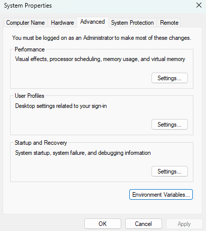

# Backend Tutorial:

[Install Node First](https://nodejs.org/dist/v24.21.0/node-v24.21.0-x64.msi)

Note: To run npm, git, or any commands in any ide with terminal
Go to environment variable paste the path of the installed command to the user variables
!: 

```npm
npm 
```